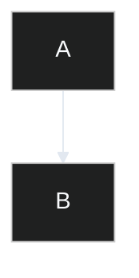
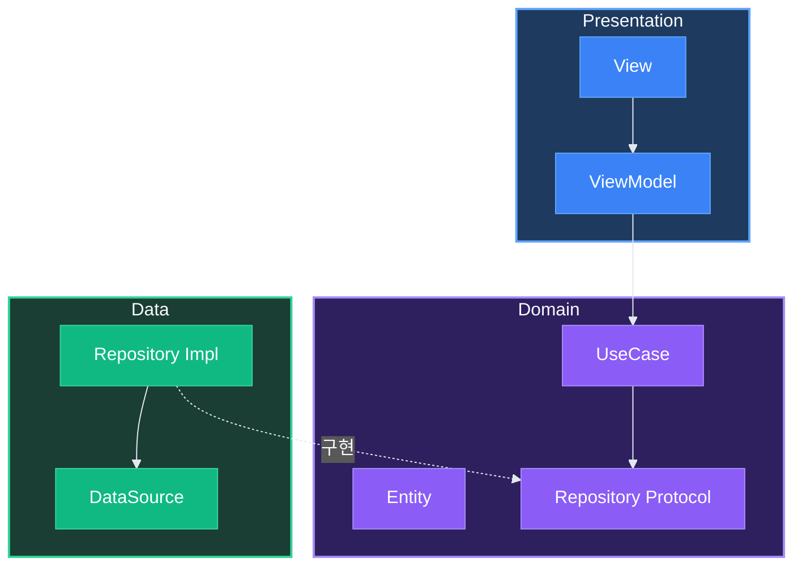
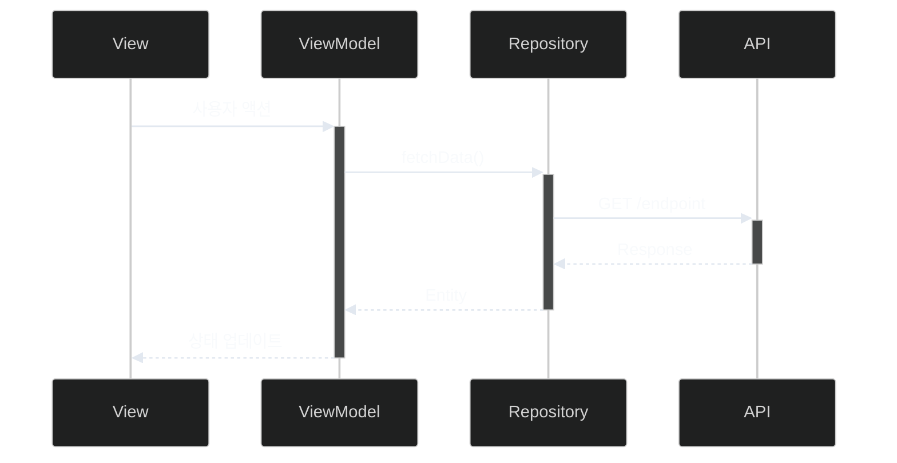
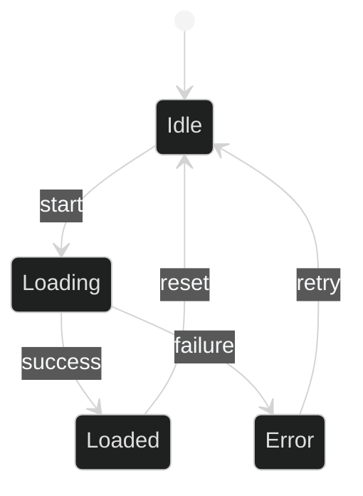
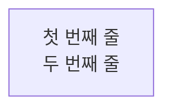
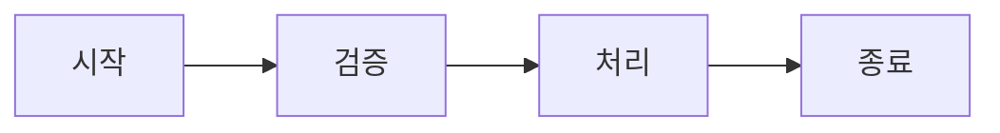

# Mermaid 다이어그램 가이드

## 지원 다이어그램

flowchart, sequence, class, state, ER, gantt

## 다크모드 최적화 설정

init 블록으로 다크 테마와 가독성을 높인 설정을 적용합니다:



## 컬러 팔레트

### 레이어별 노드 색상

| 레이어 | 배경색 | 테두리 | 텍스트 | 용도 |
|-------|--------|--------|--------|------|
| Presentation | #3b82f6 | #60a5fa | #ffffff | UI 레이어 |
| Domain | #8b5cf6 | #a78bfa | #ffffff | 비즈니스 로직 |
| Data | #10b981 | #34d399 | #ffffff | 데이터 레이어 |
| Network | #f59e0b | #fbbf24 | #1f2937 | 네트워크 |
| Error | #ef4444 | #f87171 | #ffffff | 에러 |
| Success | #22c55e | #4ade80 | #ffffff | 성공 |
| Info | #06b6d4 | #22d3ee | #ffffff | 정보 |

### 서브그래프 스타일

| 레이어 | 배경색 | 테두리 | style 예시 |
|-------|--------|--------|------------|
| Presentation | #1e3a5f | #60a5fa | style Presentation fill:#1e3a5f,stroke:#60a5fa,stroke-width:2px,color:#f8fafc |
| Domain | #2e1f5e | #a78bfa | style Domain fill:#2e1f5e,stroke:#a78bfa,stroke-width:2px,color:#f8fafc |
| Data | #1a3d34 | #34d399 | style Data fill:#1a3d34,stroke:#34d399,stroke-width:2px,color:#f8fafc |

## Flowchart 문법

### 방향 키워드

| 키워드 | 방향 |
|-------|------|
| TD / TB | 위에서 아래 |
| LR | 왼쪽에서 오른쪽 |
| BT | 아래에서 위 |
| RL | 오른쪽에서 왼쪽 |

### 노드 형태 문법

| 문법 | 형태 |
|------|------|
| [text] | 사각형 |
| (text) | 둥근 사각형 |
| {text} | 다이아몬드 |
| [(text)] | 원통형 (DB) |
| ((text)) | 원형 |

### 화살표 유형

| 문법 | 설명 |
|------|------|
| --> | 실선 화살표 |
| -.-> | 점선 화살표 |
| ==> | 굵은 화살표 |
| -->\|text\| | 레이블 화살표 |

### 베스트 프랙티스

- 기본 방향 LR (좌→우) 권장
- 모든 라벨 따옴표로 감싸기
- 특수문자 이스케이프

## Sequence 다이어그램

### 화살표 유형

| 문법 | 설명 |
|------|------|
| ->> | 동기 메시지 |
| -->> | 응답 (점선) |
| -) | 비동기 메시지 |

### 활용

- participant 별칭 사용
- alt, opt, loop 블록 활용

## Class 다이어그램

### 관계 문법

| 문법 | 관계 |
|------|------|
| <\|-- | 상속 |
| ..> | 의존 |
| ..\|> | 구현 |
| --> | 연관 |

### 정의

- 속성, 메서드 정의
- 관계: inheritance, composition, aggregation

## 아키텍처 다이어그램 템플릿

Presentation/Domain/Data 서브그래프와 classDef를 사용한 레이어 구조 예시:



## MVVM 시퀀스 다이어그램 템플릿



## State 다이어그램 템플릿



## classDef 복사용 스니펫

### 레이어별 스타일

```mermaid
classDef pres fill:#3b82f6,stroke:#60a5fa,color:#ffffff
classDef domain fill:#8b5cf6,stroke:#a78bfa,color:#ffffff
classDef data fill:#10b981,stroke:#34d399,color:#ffffff
classDef network fill:#f59e0b,stroke:#fbbf24,color:#1f2937
```

### 상태별 스타일

```mermaid
classDef success fill:#22c55e,stroke:#4ade80,color:#ffffff
classDef error fill:#ef4444,stroke:#f87171,color:#ffffff
classDef warning fill:#f59e0b,stroke:#fbbf24,color:#1f2937
classDef info fill:#06b6d4,stroke:#22d3ee,color:#ffffff
```

## 흔한 오류 및 해결

### 특수문자 이스케이프

| 문자 | 해결 방법 |
|------|----------|
| ( ) | 큰따옴표로 감싸기 "텍스트(값)" |
| [ ] | 큰따옴표로 감싸기 |
| end, class | 예약어 - 큰따옴표로 감싸기 |

### 줄바꿈



### 빈 레이블 방지

- A --> B : (빈 레이블 - 오류)
- A --> B (레이블 없음)
- A --> B : 레이블 (레이블 있음)

### 기타 주의사항

- ID에 공백 금지
- 예약어 충돌 주의
- HTML 태그 주의
- 대형 다이어그램은 분할
- subgraph로 그룹화
- 일관된 네이밍 유지

## 기본 예시


