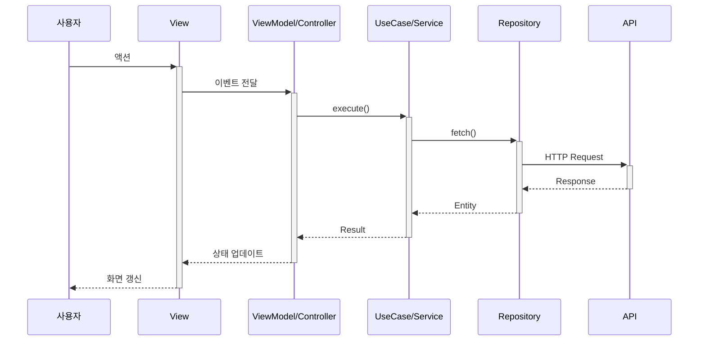

# Reverse Engineering — 레거시 코드베이스 분석

> @-tracking: `bash .cursor/hooks/usage-tracker.sh skills reverse-engineering`

문서가 없는 코드베이스를 체계적으로 분석하여 아키텍처, 비즈니스 로직, 의존성을 파악합니다.

## 6-Phase 프로세스 개요

```
Phase 1: 구조 분석 → Phase 2: 컴포넌트 카탈로그 → Phase 3: 의존성 분석
    → Phase 4: 비즈니스 로직 추출 → Phase 5: 데이터 흐름 추적 → Phase 6: 마이그레이션 로드맵
```

## Phase 1: 구조 분석

### 프로젝트 타입 식별 체크리스트

```
□ 언어 구성 확인 (단일 언어 / 하이브리드)
□ UI 프레임워크 확인
□ 의존성 관리 방식 (Package Manager, Lock 파일 등)
□ 언어 간 브릿징 존재 여부 (하이브리드 프로젝트)
```

### 아키텍처 패턴 감지

| 패턴 | 감지 신호 | 특징 |
|-----|---------|-----|
| MVC (레거시) | Controller, View, Model 혼재, 비즈니스 로직이 Controller에 | 전통적 구조 |
| MVVM | ViewModel, ObservableObject, Binding | UI와 로직 분리 |
| Clean Architecture | UseCase, Repository, Entity, 레이어별 폴더 | 엔터프라이즈급 |
| VIPER | Presenter, Interactor, Router, Entity, View | 모듈화 중심 |
| Redux/TCA | Reducer, State, Action, Effect | 상태 기반 |

### 폴더 구조 스캔

- list_dir: 루트 디렉토리
- glob: 소스 파일 패턴
- SemanticSearch: 각 폴더의 역할과 책임

### Phase 1 검증 체크리스트

```
□ 프로젝트 타입 식별 완료
□ 아키텍처 패턴 파악 완료
□ 폴더 구조 문서화 완료
```

## Phase 2: 컴포넌트 카탈로그

### 타입/클래스 인벤토리 추출

- grep: class/struct/interface/protocol 정의 패턴
- 언어별 키워드로 타입 정의 추출
- 정렬 및 중복 제거

### 타입 분류 기준

| 타입 | 네이밍 패턴 | 역할 |
|-----|-----------|------|
| Manager | *Manager | 싱글톤, 비즈니스 로직 |
| Controller | *Controller | 화면/플로우 제어 |
| View/Component | *View, *Component | UI 컴포넌트 |
| Model | Model, Dto, Response | 데이터 구조 |
| Service | *Service | 서비스 레이어 |
| Util | *Util, *Helper | 유틸리티 |

### 싱글톤 패턴 감지

- grep: sharedInstance, getInstance, static shared 등
- 싱글톤 인스턴스 목록 작성
- 의존성 분석 시 우선 고려

### Phase 2 검증 체크리스트

```
□ 클래스/타입 인벤토리 작성
□ 싱글톤 패턴 식별
□ Manager/Service 분류
□ Controller/View 계층 구조 파악
```

## Phase 3: 의존성 분석

### import/include 관계 추적

- grep: import, include, using 문
- 프로젝트 내부 vs 외부 의존 구분
- 파일별 import 관계 CSV 또는 그래프 생성

### 의존성 그래프 생성

- Mermaid flowchart로 시각화
- 서브그래프로 계층 구분 (Manager, Controller 등)
- mermaid 스킬의 classDef 활용

### 의존성 레벨 분석

| 레벨 | 설명 | 마이그레이션 우선순위 |
|-----|------|------------------|
| Level 0 | 의존성 없음 (순수 유틸) | 최우선 |
| Level 1 | Level 0만 의존 | 우선 |
| Level 2 | Level 0-1 의존 | 중간 |
| Level 3 | Level 0-2 의존 | 중간 |
| Level 4+ | 복잡한 의존성 | 후순위 |

### 순환 참조 감지

- import 관계 그래프에서 순환 경로 탐색
- Delegate/콜백 패턴의 강한 참조 검사
- 클로저/람다 내 self/this 캡처 검사

### Phase 3 검증 체크리스트

```
□ import/include 관계 추출
□ 의존성 그래프 생성
□ 의존성 레벨 분석
□ 순환 참조 확인
```

## Phase 4: 비즈니스 로직 추출

### 메서드 시그니처 분석

- grep: public/protected 메서드 정의
- 헤더/인터페이스 파일에서 공개 API 추출
- 100줄 이상 메서드 식별 (리팩토링 후보)

### 메서드 분류

| 카테고리 | 패턴 | 역할 |
|---------|-----|------|
| init | init*, setup* | 초기화 로직 |
| network | fetch*, post*, get* | API 호출 |
| data | parse*, convert*, transform* | 데이터 변환 |
| business | calculate*, validate*, process* | 핵심 로직 |
| UI | update*, refresh*, reload* | UI 갱신 |
| event | on*, handle*, did* | 이벤트 처리 |

### 조건 분기 분석

- if/switch/guard 사용 패턴
- 중첩 분기 단계 (3단계 이상 주의)
- 복잡한 조건 로직 문서화

### 에러 처리 패턴 분석

- 에러 타입/예외 정의
- try-catch, Result, 콜백 패턴
- 마이그레이션 시 에러 처리 전환 방향

### Phase 4 검증 체크리스트

```
□ 핵심 메서드 시그니처 분석
□ 조건 분기 로직 분석
□ 에러 처리 패턴 확인
□ 네트워크 요청 타입 추출
```

## Phase 5: 데이터 흐름 추적

### 흐름 추적 단계

사용자 액션 → Controller/ViewModel → Service/UseCase → Repository/API → 응답 → 상태 업데이트 → UI 갱신

### 시퀀스 다이어그램 템플릿 (일반화)



### 상태 관리 분석

- 전역 상태 저장소
- 로컬 상태 (Controller/ViewModel)
- 상태 동기화 패턴 (Observer, Pub/Sub, Event Bus)

### Phase 5 검증 체크리스트

```
□ 사용자 액션 진입점 파악
□ API 호출 흐름 추적
□ 상태 관리 방식 분석
□ UI 업데이트 패턴 확인
```

## Phase 6: 마이그레이션 로드맵

### 복잡도 평가 기준

| 기준 | Low (1점) | Medium (2점) | High (3점) |
|-----|---------|-------------|-----------|
| 코드 라인 수 | < 100 | 100-300 | > 300 |
| 의존성 수 | 0-2개 | 3-5개 | 6개 이상 |
| 조건 분기 | 단순 | 중첩 2단계 | 중첩 3단계 이상 |
| 비즈니스 로직 | 단순 CRUD | 계산/변환 | 복잡한 상태 머신 |
| UI 복잡도 | 단순 | 테이블/리스트 | 커스텀 드로잉/애니메이션 |
| 네트워크 | 없음 | 단순 CRUD | 다중 요청/실시간 |
| 테스트 가능성 | 순수 함수 | DI 가능 | 싱글톤/전역 상태 |

### 우선순위 매트릭스

| 우선순위 | 복잡도 | 의존성 레벨 | 비즈니스 중요도 |
|---------|-------|-----------|--------------|
| P1 (최우선) | Low | Level 0-1 | High |
| P2 (우선) | Low-Medium | Level 1-2 | High |
| P3 (중간) | Medium | Level 2-3 | Medium |
| P4 (후순위) | High | Level 3+ | Medium |
| P5 (선택) | Any | Any | Low |

### 로드맵 템플릿 구조

- 프로젝트 개요 (파일 수, LOC, 예상 기간)
- Phase별 작업 목록 (복잡도, 의존성, 예상 공수)
- 주차별 계획
- 리스크 관리

### Phase 6 검증 체크리스트

```
□ 복잡도 평가 완료
□ 우선순위 결정 완료
□ 의존성 순서 정리
□ 주차별 계획 작성
□ 리스크 평가 완료
```

## 출력 문서 구조

```
ReverseEngineering/
├── 00-분석-개요.md        # 분석 범위, 통계, 아키텍처 요약
├── 01-아키텍처-분석.md    # 아키텍처 다이어그램, 레이어, 패턴
├── 02-컴포넌트-카탈로그.md # 클래스 인벤토리, 싱글톤, 계층
├── 03-의존성-그래프.md     # 의존성 다이어그램, 레벨, 순환 참조
├── 04-비즈니스-로직/       # 기능별 상세 문서
├── 05-데이터-모델.md       # Entity, DTO, Response 타입
├── 06-네트워크-레이어.md   # API 엔드포인트, 요청 타입
├── 07-상태-관리.md         # 전역/로컬 상태, 동기화 패턴
├── 08-마이그레이션-로드맵.md # 복잡도, 우선순위, 계획
└── 09-기술-부채.md         # 문제점, 리팩토링 포인트
```

## 핵심 원칙

1. 추측 금지: 모든 분석은 실제 코드에서 추출
2. 점진적 분석: Phase별로 순차 진행
3. 즉시 문서화: 분석 결과는 문서에 기록
4. 다이어그램 포함: Mermaid로 시각화
5. 코드 경로 명시: 모든 결론에 소스 경로 포함

## 사용 도구

Grep, Glob, SemanticSearch, Shell (git log, find 등)

## deep-index 연동

deep-index 스킬이 있으면 해당 결과를 활용하여 더 정확한 분석을 수행합니다.
