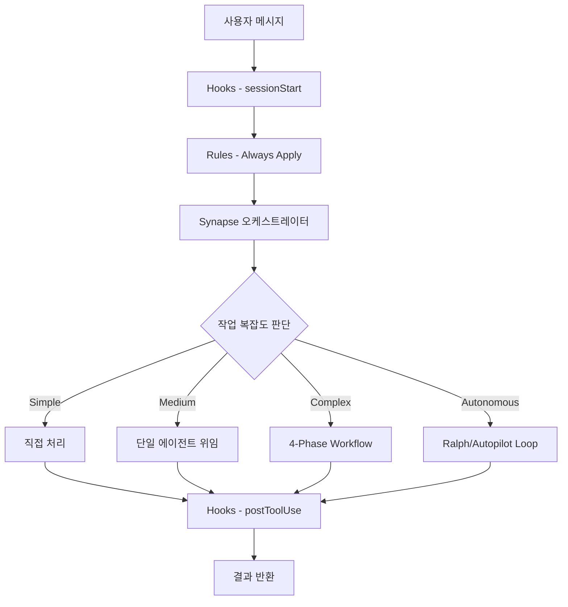
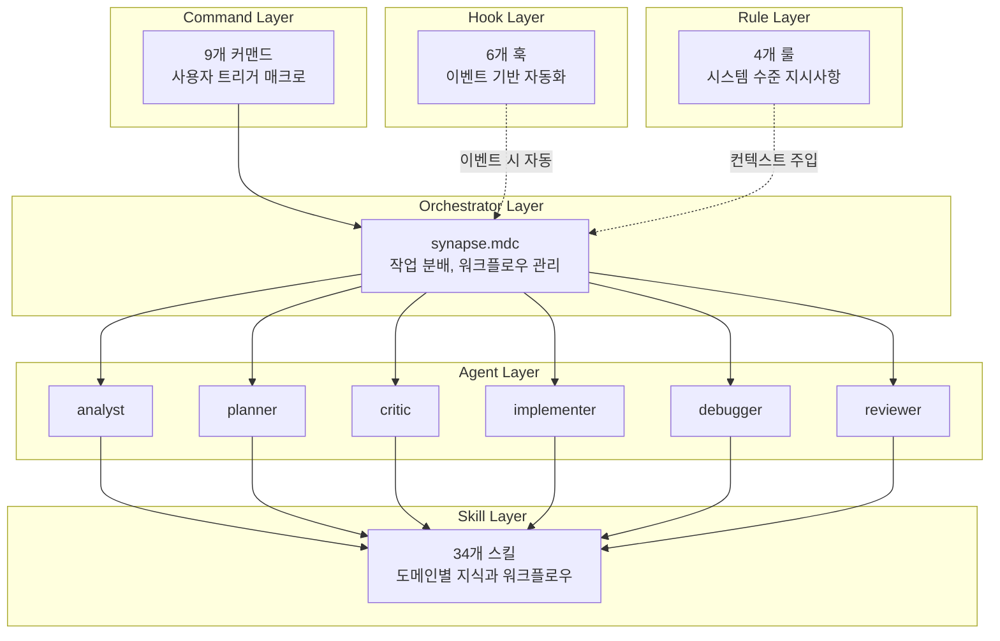

# 아키텍처

> 저자: jimmy | 날짜: 2026-02-16

## 개요

cursor_symbiote는 Orchestrator Pattern을 사용합니다. 중앙 오케스트레이터(Synapse)가 작업 복잡도를 판단하고, 적절한 에이전트/스킬/커맨드를 선택하여 워크플로우를 관리합니다.

## 전체 흐름



## 계층 구조



| 계층 | 역할 | 파일 위치 |
|------|------|-----------|
| Orchestrator | 작업 분배, 워크플로우 관리 | `rules/kernel/synapse.mdc` |
| Agents | 전문 작업 수행 (컨텍스트 격리) | `agents/*.md` |
| Skills | 도메인별 지식과 워크플로우 | `skills/*/SKILL.md` |
| Commands | 사용자가 직접 트리거하는 매크로 | `commands/*.md` |
| Hooks | 이벤트 기반 자동화 | `hooks.json` + `hooks/*.sh` |
| Rules | 시스템 수준 지시사항 | `rules/**/*.mdc` |

## 적용 시점

```
세션 시작 ──→ sessionStart Hook 실행
           ──→ alwaysApply: true 룰 로드 (synapse.mdc, context.mdc)

메시지 입력 ──→ globs 매칭 룰 자동 적용
           ──→ Agent가 관련 Skill 자동 감지 및 적용

/커맨드 입력 ──→ 해당 커맨드 파일 실행

도구 사용 전 ──→ preToolUse Hook 실행 (guard-shell.sh)
도구 사용 후 ──→ postToolUse Hook 실행 (usage-tracker.sh 등)
파일 편집 후 ──→ afterFileEdit Hook 실행 (comment-checker.sh)
```

## 복잡도별 워크플로우

### Simple (단일 파일 수정, 질문)

Synapse가 직접 처리합니다. Subagent overhead를 방지합니다.

### Medium (버그 수정, 단일 API 추가)

```
debugger 또는 implementer → reviewer
```

### Complex (3개 이상 파일, 새 Feature)

```
Phase 0: analyst (요구사항 분석)
Phase 1: planner → critic (기획 + 검증)
Phase 2: implementer (구현)
Phase 3: reviewer + qa-tester (검증, 병렬)
→ 실패 시 Phase 2로 회귀
```

### Autonomous (대규모 자율 작업)

```
/ralph  → Plan→Execute→Verify 반복 (최대 10회)
/autopilot → Analyze→Plan→Execute→Verify 병렬 파이프라인 (최대 3회)
```

## Skill Composition (3-Layer)

스킬은 3개 레이어로 조합되어 실행 전략을 결정합니다.

```
Guarantee Layer (선택, 0-1):  ralph — "검증 완료까지 멈추지 않음"
Enhancement Layer (0-N):      autopilot | tdd | ecomode
Execution Layer (필수, 1):    default | orchestrate | planner
```

공식: `[Execution] + [0-N Enhancement] + [Optional Guarantee]`

| 예시 | 조합 |
|------|------|
| "ralph: refactor auth" | default + ralph |
| "autopilot tdd: implement login" | default + autopilot + tdd |
| "eco fix errors" | default + ecomode |
| "plan the API" | planner |

## 4-Level 완료 기준

| Level | 이름 | 기준 | 적용 |
|-------|------|------|------|
| 1 | Minimal | 코드 완료 + Lint 0 에러 | 단순 수정 |
| 2 | Standard | Level 1 + 기능 동작 + Reviewer 승인 | 일반 작업 |
| 3 | Thorough | Level 2 + 테스트 통과 + QA 검증 | Feature 구현 |
| 4 | Production | Level 3 + 보안 검토 + 문서화 | 릴리즈 |

프로젝트 기본 Level은 `manifest.json`의 `defaults.completionLevel`에서 설정합니다.

## 자연어 모드 감지 (전체)

| 키워드 패턴 | 활성화 모드 | 동작 |
|------------|-----------|------|
| "끝까지", "완료할 때까지", "멈추지 마" | Ralph Mode | autonomous-loop 스킬 |
| "심층 분석", "깊이 파악", "deep search" | Deep Analysis | analyst + deep-search 병렬 |
| "보안 포함", "보안 검토" | Security Mode | security-reviewer 포함 |
| "테스트까지", "tdd", "test first" | QA/TDD Mode | tdd + qa-tester 포함 |
| "문서화까지", "with docs" | Doc Mode | doc-writer 포함 |
| "최대 성능", "병렬로", "autopilot" | Autopilot | 4-Phase 병렬 파이프라인 |
| "절약", "eco", "budget" | Ecomode | 토큰 절약 실행 |
| "요구사항 정리", "PRD" | PRD Mode | prd 스킬 실행 |
| "인덱싱", "코드베이스 파악" | Index Mode | deep-index 스킬 |
| "조사", "research", "리서치" | Research Mode | research 스킬 |
| "기획 합의", "ralplan" | Ralplan Mode | 반복적 기획 합의 |
| "빌드 수정", "build fix" | Build Fix | build-fix 스킬 |
| "취소", "cancel", "중단" | Cancel | 자율 루프 중단 |
| "도움말", "help", "사용법" | Help | 기능 목록 표시 |

## Parallel Agent Dispatch

독립적인 작업은 Task tool로 병렬 실행합니다 (최대 4개).

| 단계 | 병렬 조합 |
|------|----------|
| 분석 | analyst + deep-search |
| 기획 | planner + deep-search |
| 검증 | reviewer + qa-tester |
| 탐색 | Grep + SemanticSearch + Glob |
