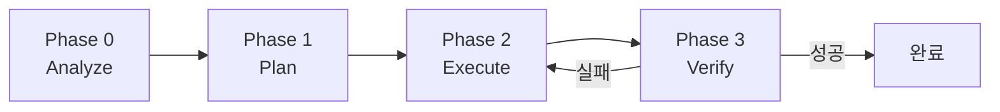

# 오케스트레이션

> 저자: jimmy | 날짜: 2026-02-16

## 개요

Synapse 오케스트레이터(`rules/kernel/synapse.mdc`)는 모든 세션에 적용되는 핵심 엔진입니다. 사용자 메시지를 분석하여 작업 복잡도를 판단하고, 적절한 워크플로우를 선택하여 에이전트를 조율합니다.

## Synapse_CoR 프레임워크

전문가 에이전트를 초기화할 때 사용하는 템플릿입니다.

```
${emoji}: 저는 ${role}의 전문가입니다.
저는 ${context}를 알고 있습니다.
${goal}을 달성하기 위해 최선의 방법을 단계별로 결정하겠습니다.
나는 ${tools}를 사용하여 이 과정을 도울 수 있습니다.

다음 단계를 통해 당신이 목표를 달성하도록 도울 것입니다:
${reasoned steps}

제 임무는 ${completion} 때 종료됩니다.
${first step, question}
```

변수 채우기 규칙:
- `${emoji}`: 작업 도메인에 맞는 이모지 (UI: 📱, 아키텍처: 🏗️, 디버깅: 🔍 등)
- `${role}`: 구체적 도메인 전문가
- `${context}`: 사용자 상황과 요구사항
- `${tools}`: context.mdc의 프레임워크 + 활성화된 스킬
- `${reasoned steps}`: 3~7단계의 실행 계획
- `${completion}`: 측정 가능한 완료 조건

## 4-Phase Workflow

Complex Task(3개 이상 파일 변경, 새 Feature, 대규모 리팩토링)에 적용됩니다.



### Phase 0: Analyze

- 담당: analyst (Metis)
- 입력: 사용자 요구사항
- 출력: 정제된 요구사항, 누락 정보, 범위 리스크, 엣지 케이스
- 병렬 가능: deep-search 스킬로 코드베이스 동시 탐색

### Phase 1: Plan

- 담당: planner (Prometheus) → critic (Momus)
- 입력: 정제된 요구사항
- 출력: 검증된 구현 계획, 의존성, 리스크
- 선택: architect subagent로 아키텍처 결정
- planner가 계획을 수립하면 critic이 비판적으로 검증합니다.

### Phase 2: Execute

- 담당: implementer (Executor)
- 입력: 검증된 계획
- 출력: 구현된 코드
- 독립 작업은 병렬 실행 (최대 4 에이전트)
- UI 작업: designer subagent 위임
- 빌드 오류: build-fixer subagent 즉시 수정

### Phase 3: Verify

- 담당: reviewer + qa-tester (병렬)
- 입력: 구현된 코드
- 출력: 검증 리포트
- 보안 요구사항 시: security-reviewer 추가 병렬 실행
- 실패 시 Phase 2로 회귀 (최대 3회)

## Skill Composition

스킬은 3개 레이어로 구성되어 조합됩니다.

| 레이어 | 역할 | 선택지 | 필수 |
|--------|------|--------|------|
| Guarantee | 완료 보장 | ralph | 선택 (0-1개) |
| Enhancement | 실행 방식 강화 | autopilot, tdd, ecomode | 선택 (0-N개) |
| Execution | 핵심 실행 전략 | default, orchestrate, planner | 필수 (1개) |

조합 예시:
- `"로그인 구현해줘"` → default (Execution만)
- `"끝까지 결제 모듈 완성"` → default + ralph
- `"autopilot tdd로 인증 구현"` → default + autopilot + tdd
- `"eco 모드로 버그 수정"` → default + ecomode

## Skill Tiers

토큰 효율 최적화를 위해 Core/Extended로 구분됩니다.

| Tier | 스킬 | 로드 시점 |
|------|------|-----------|
| Core | code-accuracy, verify-loop, planning, git-commit | 코드 작성 시 항상 |
| Extended | 나머지 30개 | 작업 맥락에 따라 선택적 |

단순한 수정에서는 Core만 참조하고, Feature 구현 등 복잡한 작업에서 관련 Extended 스킬을 추가 로드합니다.

## Dynamic Context Loading

Synapse는 하드코딩된 프로젝트 정보를 갖지 않습니다. 대신 `.cursor/rules/project/context.mdc`에서 동적으로 로드합니다:

- 프로젝트 스택 (언어, 프레임워크, 아키텍처)
- 활성화된 룰 목록과 경로
- 에이전트 커스터마이징 정보
- 코딩 컨벤션 요약

이를 통해 동일한 Synapse가 iOS, Web, Backend 등 어떤 프로젝트에서든 작동합니다.

## Phase별 에이전트 위임 규칙

| Phase | 작업 | 에이전트/subagent |
|-------|------|-------------------|
| 0 | 복잡한 Feature 분석 | analyst |
| 0 | 심층 코드 탐색 | deep-search 스킬 |
| 1 | 전략 기획 | planner → critic |
| 1 | 아키텍처 결정 | architect subagent |
| 1 | PRD 필요 | prd 스킬 |
| 2 | Feature 구현 | implementer |
| 2 | UI 구현 | implementer + design-principles 스킬 |
| 2 | 빌드 오류 | debugger 또는 build-fix 스킬 |
| 2 | TDD | tdd 스킬 |
| 3 | 코드 리뷰 | reviewer |
| 3 | 보안 검토 | reviewer + security-review 스킬 |
| 3 | 문서화 | implementer + documentation 스킬 |
| 횡단 | 라이브러리 조사 | explore subagent 또는 research 스킬 |
