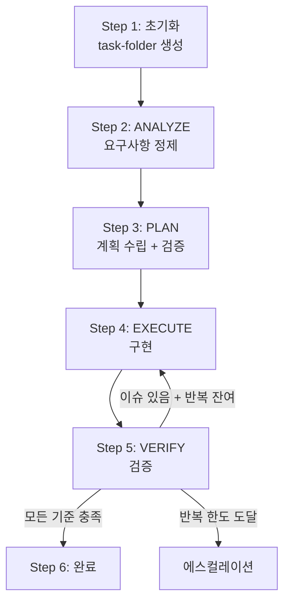

# 자율 실행 루프

> 저자: jimmy | 날짜: 2026-02-16

## 개요

Autonomous Loop은 Plan→Execute→Verify를 반복하여 복잡한 작업을 사용자 개입 없이 자율적으로 완성하는 메커니즘입니다. Ralph Mode(완료 보장)와 Autopilot Mode(병렬 최대 성능) 두 가지 모드를 지원합니다.

## 두 가지 모드

| 항목 | Ralph | Autopilot |
|------|-------|-----------|
| 트리거 | "끝까지", `/ralph` | "최대 성능", `/autopilot` |
| 최대 반복 | 10회 (설정 가능) | 3회 |
| 병렬 실행 | 선택적 | 적극적 |
| 상태 추적 | ralph-state.md | notepad.md |
| 목적 | 완료 보장 | 빠른 처리 |

## Task-Folder 구조

모든 상태 파일은 작업별 폴더에 격리됩니다.

```
.cursor/project/state/{ISO8601-basic}_{task-name}/
├── ralph-state.md     # 루프 제어 메타데이터
├── notepad.md         # 작업 메모 (note 스킬)
└── prd.md             # PRD (선택)
```

예시: `2026-02-13T1430_login-feature`

## ralph-state.md 형식

```markdown
# Ralph State

- active: true
- iteration: 0
- maxIterations: 10
- phase: analyze
- taskDescription: ...
- completionLevel: 2
- startedAt: 2026-02-13T14:30:00Z
- prdPath: none

## 실행 이력

- [1] phase: execute | result: ... | action: fix
- [2] phase: verify | result: ... | action: retry
```

## 6-Step 워크플로우



### Step 1: 초기화

- task-folder 생성: `mkdir -p .cursor/project/state/{ISO8601-basic}_{task-name}`
- Ralph: `ralph-state.md` 생성 (active: true, iteration: 0)
- Autopilot: `notepad.md`로 상태 추적

### Step 2: ANALYZE

- analyst 에이전트로 요구사항 정제
- 코드베이스 및 제약사항 분석
- PRD가 있으면 acceptance criteria 로드

### Step 3: PLAN

- planning 스킬에 따라 계획 수립
- Grep + SemanticSearch + Glob 병렬 실행으로 코드베이스 분석
- critic으로 계획 검증 (완전성, 의존성, 파괴적 변경, 실현 가능성)

### Step 4: EXECUTE

- context.mdc의 프로젝트 패턴을 따르며 구현
- 독립 작업은 병렬 실행 (최대 4개, Autopilot에서 적극 활용)
- 단계 완료 시마다 TODO 기록

### Step 5: VERIFY

- 코드 품질, 패턴 준수, ReadLints 검사
- verify-loop 4-Level 기준 대조
- Level >= 3: qa-tester 에이전트로 기능 검증
- Level >= 4: security-reviewer, doc-writer 추가 검증

### Step 6: LOOP 또는 완료

- 모든 기준 충족 → 완료 (active: false, phase: complete)
- 이슈 발견 + 반복 잔여 → 실패 원인 분석 → Fix → Step 4로 복귀
- 반복 한도 도달 → 에스컬레이션

## 에스컬레이션 규칙

다음 상황에서 루프를 중단하고 사용자에게 질문합니다.

| 조건 | Ralph | Autopilot |
|------|-------|-----------|
| 최대 반복 도달 | 10회 | 3회 |
| 동일 오류 연속 | 3회 | 2회 |
| 아키텍처/파괴적 변경 | 사용자 승인 필요 | 사용자 승인 필요 |
| 요구사항 모호 | 사용자 확인 | 사용자 확인 |
| 보안 관련 결정 | 사용자 확인 | 사용자 확인 |

에스컬레이션 시 notify-user 스킬을 호출합니다:
- Slack-First 모드가 자동 활성화
- AskQuestion 없이 Slack DM으로 직접 질문
- 30초 간격 폴링으로 응답 대기 (최대 10분)
- 타임아웃 시 ralph-state.md phase를 `waiting-user`로 변경 후 일시정지

## 재시도 전략 (verify-loop 스킬)

검증 실패 시 적용되는 자기 수정 전략입니다.

### 원인 분석 필수

즉시 수정하지 않고, 반드시 원인을 먼저 분석합니다:
1. 무엇이 실패했는가 (증상)
2. 왜 실패했는가 (근본 원인)
3. 이전 시도에서 무엇이 잘못되었는가
4. 다음 시도에서 무엇을 다르게 할 것인가

### 동일 접근 금지

- 같은 방식으로 재시도하지 않습니다
- 같은 에러가 2회 반복되면 근본적으로 다른 접근법을 시도
- 총 5회 재시도 후 사용자 에스컬레이션

## 병렬 실행 (Autopilot)

| Step | 병렬 대상 |
|------|----------|
| Step 3 | Grep + SemanticSearch + Glob 동시 실행 |
| Step 4 | 독립 파일 생성 병렬 |
| Step 5 | 여러 파일 ReadLints 병렬, reviewer + qa-tester 병렬 |

## 진행 보고 형식

```
[Autonomous Loop 진행] iteration N/M (모드)
- Task: {task-folder}
- Phase: [현재 단계]
- 최근 결과: [요약]
- 남은 이슈: [목록]
- 다음 조치: [fix|retry|escalate]
```

## 완료 후 정리

- Ralph: `ralph-state.md`의 active를 false, phase를 complete로 변경
- Autopilot: 완료 보고 형식으로 결과 출력
- 완료된 task-folder는 `/clean` 커맨드로 정리 가능

## 관련 스킬

| 스킬 | 역할 |
|------|------|
| autonomous-loop | 루프 메인 워크플로우 |
| verify-loop | 자기 수정 루프, 4-Level 완료 기준 |
| planning | 개발 계획 수립 |
| code-accuracy | 코드 정확성 검증 |
| note | Compaction 내성 메모장 |
| notify-user | Slack 에스컬레이션 |
| cancel | 안전한 루프 중단 |
