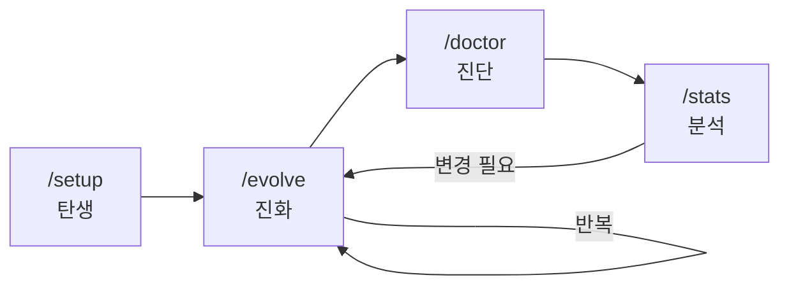

# 자기 진화 메커니즘

> 저자: jimmy | 날짜: 2026-02-16

## 개요

cursor_symbiote는 정적인 설정 파일이 아니라, 프로젝트와 함께 성장하는 시스템입니다. `/setup`으로 탄생하고, `/evolve`로 진화하며, `/doctor`로 건강을 진단하고, `/stats`로 사용 패턴을 분석합니다.

## 생명주기



## /setup — 탄생

프로젝트에 `.cursor/`를 처음 적용할 때 실행합니다.

### 실행 조건

`manifest.json`이 존재하지 않을 때만 실행됩니다. 이미 존재하면 `/evolve` 사용을 안내합니다.

### 워크플로우

1. 환경 준비: hooks 실행 권한 부여, usage-data 초기화
2. 프로젝트 감지: 6개 Track을 병렬 실행
   - Track A: 언어 감지 (파일 확장자)
   - Track B: 패키지 매니저 감지
   - Track C: 프레임워크 감지 (import 구문)
   - Track D: 아키텍처 감지 (폴더 구조, 패턴)
   - Track E: CI/CD 감지
   - Track F: 빌드 도구 감지
3. 이전 버전 감지: `.cursor.back` 존재 시 마이그레이션 지원
4. 스킬팩/참고자료 요청: 사용자에게 추가 설정 기회 제공
5. `manifest.json` 생성: 프로젝트 스택, 활성화된 구성 요소 기록
6. `context.mdc` 생성: 모든 에이전트가 참조하는 프로젝트 컨텍스트
7. 프로젝트별 규칙 생성 (선택)
8. VERSION 파일 및 히스토리 기록

### 이전 버전 마이그레이션

`.cursor.back`이 감지되면 파일을 3가지로 분류합니다:

| 분류 | 기준 | 처리 |
|------|------|------|
| origin | 기본 제공 파일, 내용 동일 | 새 버전 사용 (이관 스킵) |
| origin (modified) | 기본 파일을 사용자가 수정 | 새 버전 존중, 수정본은 `history/modified-origins/`에 백업 |
| custom | 사용자가 만든 파일 | 새 환경으로 이관 |

### source 태그

모든 파일에 `source: origin` 또는 `source: custom` 태그가 부여됩니다:
- `origin`: 기본 번들 파일 — `/evolve` 시 안전하게 업그레이드
- `custom`: 사용자 파일 — `/evolve` 시 보존

## /evolve — 진화

프로젝트가 변경된 후 설정을 업데이트할 때 실행합니다.

### 실행 조건

`manifest.json`이 존재해야 합니다. 없으면 `/setup`을 먼저 실행하도록 안내합니다.

### 워크플로우

1. 현재 상태 스냅샷: manifest.json, context.mdc 읽기
2. 변경 감지: setup과 동일한 감지 로직 재실행
3. 드리프트 분석: 현재 상태 vs manifest 비교 (추가/제거/변경 항목)
4. 진화 계획 제시: 변경 사항과 규칙 업데이트 제안
5. 사용자 승인
6. 변경 적용: manifest 업데이트 (moltCount 증가), context.mdc 갱신, 규칙 수정
7. 히스토리 기록

### moltCount

`manifest.json`의 `moltCount`는 evolve 실행마다 1씩 증가합니다. `evolution.history`에 각 진화 기록이 추가됩니다.

### 트리거 권장 상황

- 새 의존성 추가 후
- 대규모 리팩토링 후
- 새 모듈/Feature 추가 후
- 주기적 (월 1회)

## /doctor — 진단

`.cursor` 설정의 건강 상태를 자동으로 검사합니다.

### 검사 항목

- 파일 존재 여부: 필수 파일 누락 감지
- 경로 무결성: 참조 경로가 실제 존재하는지 확인
- 실행 권한: hooks 스크립트의 `chmod +x` 확인
- frontmatter 유효성: 필수 필드 존재 확인
- 스키마 검증: manifest.json 구조 확인

### validate.sh (Layer 2)

`.cursor/skills/doctor/scripts/validate.sh`는 자동화된 구조 검증 스크립트입니다:
- frontmatter 검사
- 경로 참조 검사
- 스키마 유효성 검사

## /stats — 사용 분석

스킬/커맨드/에이전트의 사용 빈도를 분석합니다.

### 데이터 소스

`usage-tracker.sh` 훅이 자동으로 추적합니다:
- 파일 위치: `.cursor/project/usage-data/{category}/{name}`
- 카테고리: skills, commands, agents, subagents, system-skills
- 형식: `{횟수}|{ISO8601}`
- 추적 시작일: `.tracked-since`
- 추적 소스: postToolUse(Read) hook, subagentStart hook, CLI 자기보고

### 분석 결과

- 사용 빈도 순위
- 미사용 항목 하이라이트
- 제거 추천

### 초기화

```
/stats --reset           # 전체 초기화
/stats --reset 스킬       # 스킬만 초기화
/stats --reset code-accuracy, git-commit  # 특정 항목만
```

## /learner — 패턴 학습

세션에서 반복되는 작업 패턴을 감지하고, 새 스킬/룰로 자동 추출합니다. evolve 스킬과 연동하여 설정 진화에 기여합니다.

## 진화 원칙

1. 반복 패턴은 Skill이나 Command로 캡슐화
2. 500줄 초과 룰은 분리
3. 중복 지식은 하나의 참조 소스로 통합
4. 공식 문서 변경 시 `docs/cursor-official-reference.md` 갱신
5. Apply Intelligently 룰은 Skill로 전환 검토
6. 반복적 검증 작업은 Hook으로 자동화

## Compaction 내성 (Note 시스템)

`.cursor/project/state/{task-folder}/notepad.md`에 중요한 컨텍스트를 저장합니다:

- 작업별 task-folder로 격리되어 동시 다중 작업 지원
- 컨텍스트 윈도우 초과 시에도 핵심 정보 보존
- Ralph Loop / Autopilot iteration 간 상태 전달
- 에이전트 간 정보 공유
- 완료 후 `/clean` 커맨드로 정리

## 품질 게이트

`cursor-official-reference.mdc` 룰이 `.cursor/` 내부 파일의 품질 게이트 역할을 합니다:

- `.cursor/` 내 파일 생성/수정 시 자동 활성화 (globs 기반)
- 파일 유형별 체크리스트 강제 (Rules, Commands, Skills, Agents, Hooks)
- 불확실한 스펙은 `docs/cursor-official-reference.md`를 참조
