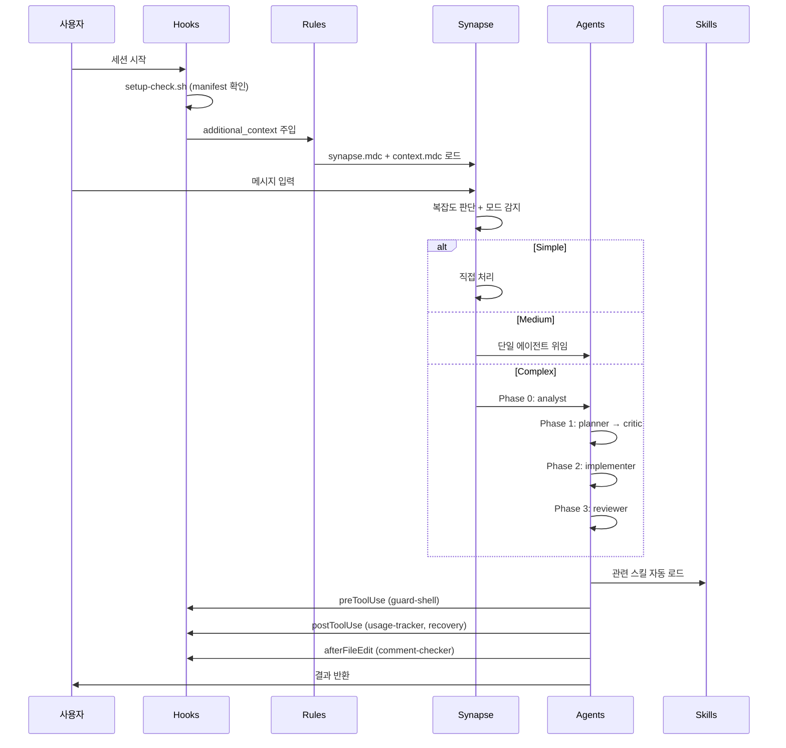
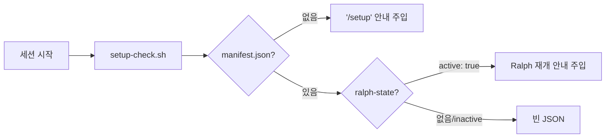
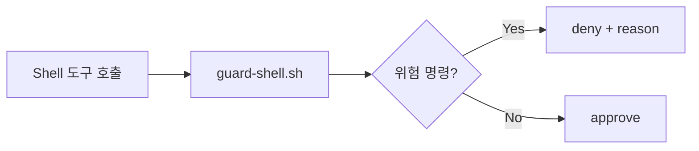
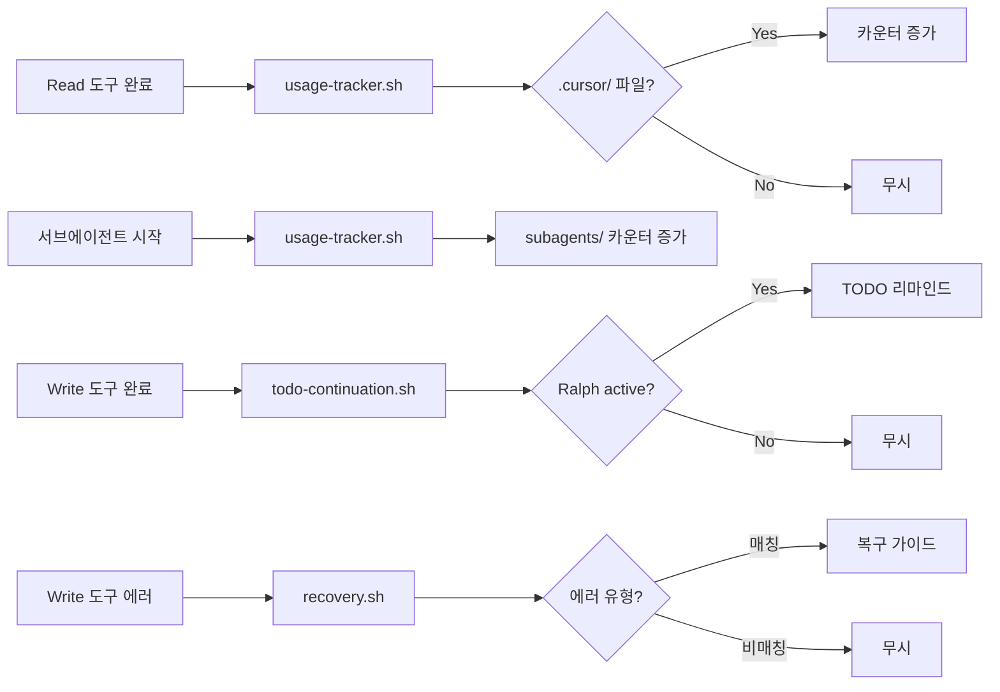
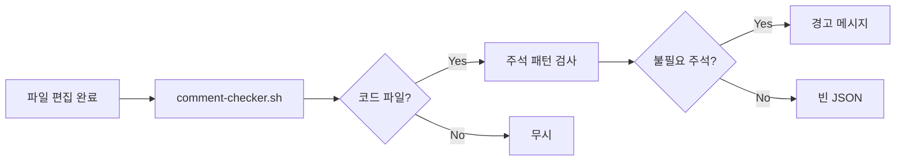
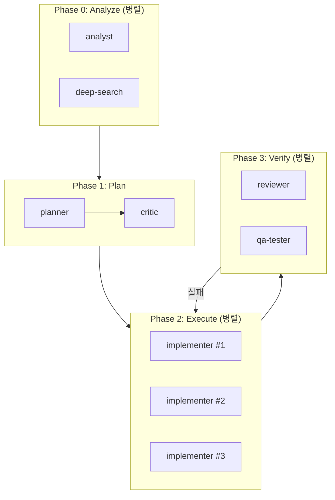

# 데이터 흐름

> 저자: jimmy | 날짜: 2026-02-16

## 개요

cursor_symbiote에서 데이터는 사용자 메시지 → 훅 → 룰 → 오케스트레이터 → 에이전트/스킬 → 훅 순서로 흐릅니다. 이 문서는 메시지 처리 흐름, 상태 관리, 에이전트 간 통신 방식을 설명합니다.

## 메시지 처리 전체 흐름



## 상태 관리

### 1. 프로젝트 설정 상태 (영구적)

| 파일 | 역할 | 갱신 시점 |
|------|------|-----------|
| `manifest.json` | 프로젝트 스택, 구성 요소 목록 | `/setup`, `/evolve` |
| `context.mdc` | 프로젝트 컨텍스트 (모든 에이전트 참조) | `/setup`, `/evolve` |
| `VERSION` | 설정 버전 | `/setup`, `/evolve` |

### 2. 작업 상태 (임시적)

| 파일 | 역할 | 생명주기 |
|------|------|----------|
| `ralph-state.md` | 자율 루프 제어 | 루프 시작 → 루프 종료 |
| `notepad.md` | 작업 메모, 에이전트 간 공유 | 작업 시작 → `/clean` |
| `prd.md` | PRD, acceptance criteria | `/prd` → 구현 완료 |

모든 작업 상태는 `project/state/{task-folder}/`에 격리됩니다.

### 3. 사용 추적 데이터 (누적)

| 파일 | 역할 | 갱신 시점 |
|------|------|-----------|
| `usage-data/skills/{name}` | 스킬 사용 횟수 | 스킬 파일 Read 시 (자동) |
| `usage-data/commands/{name}` | 커맨드 사용 횟수 | 커맨드 파일 Read 시 (자동) |
| `usage-data/agents/{name}` | 에이전트 사용 횟수 | 에이전트 파일 Read 시 (자동) |
| `usage-data/subagents/{name}` | 빌트인 서브에이전트 횟수 | 서브에이전트 시작 시 (자동) |
| `usage-data/system-skills/{name}` | 시스템 스킬 횟수 | 시스템 스킬 Read 시 (자동) |
| `usage-data/.tracked-since` | 추적 시작일 | `/setup`, `/stats --reset` |

## 에이전트 간 통신

에이전트는 자체 컨텍스트 창에서 독립적으로 작동하므로 직접 통신하지 않습니다. 대신 다음 3가지 간접 통신 메커니즘을 사용합니다.

### 1. 오케스트레이터 중개

Synapse가 에이전트 A의 출력을 에이전트 B의 입력으로 전달합니다.

```
analyst 출력 → Synapse → planner 입력
planner 출력 → Synapse → critic 입력
implementer 출력 → Synapse → reviewer 입력
```

### 2. notepad.md 공유

작업별 `notepad.md`에 중요 컨텍스트를 기록하면 다른 에이전트가 읽을 수 있습니다.

```
analyst → notepad.md에 분석 결과 기록
planner → notepad.md에서 분석 결과 읽고, 계획 기록
implementer → notepad.md에서 계획 읽고, 구현
```

### 3. Task tool prompt

Task tool로 서브에이전트를 호출할 때 prompt에 필요한 컨텍스트를 직접 전달합니다.

## Hook 데이터 흐름

### sessionStart Hook



### preToolUse Hook



### postToolUse Hook + subagentStart Hook



### afterFileEdit Hook



## Autopilot 병렬 데이터 흐름

Autopilot 모드에서는 독립적인 작업을 병렬로 처리합니다.



## 컨텍스트 윈도우 관리

### Compaction 내성

긴 자율 루프에서 컨텍스트 윈도우가 초과될 수 있습니다. note 스킬이 `notepad.md`에 핵심 정보를 저장하여 이를 방지합니다:

1. 매 iteration마다 핵심 결정 사항을 notepad에 기록
2. 컨텍스트 윈도우가 부족해지면 notepad에서 복원
3. 에이전트 전환 시 notepad를 통해 정보 전달

### Skill Tiers로 토큰 절약

- Core 스킬(4개): 코드 작성 시 항상 로드
- Extended 스킬(30개): 필요할 때만 선택적 로드
- ecomode: fast 모델 우선, 병렬 제한으로 토큰 절약
