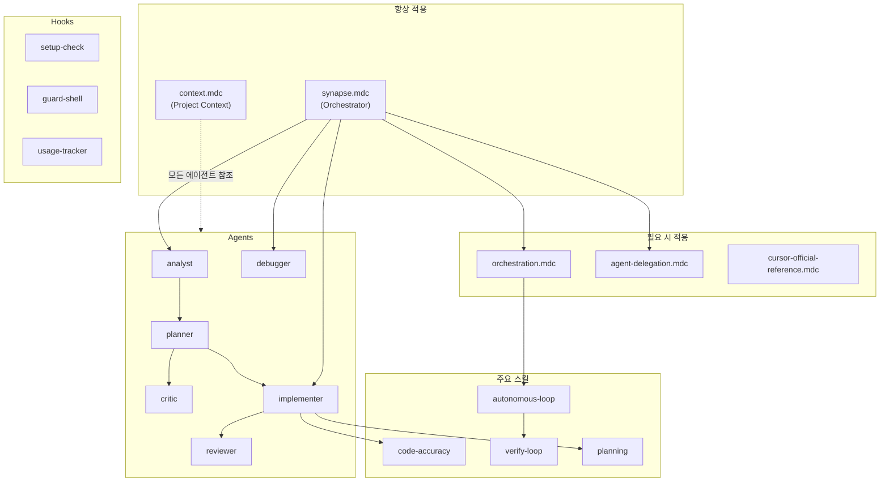

# 구성 요소 관계

> 저자: jimmy | 날짜: 2026-02-16

## 개요

cursor_symbiote의 6가지 구성 요소(Rules, Commands, Skills, Agents, Hooks, Tests)는 서로 의존하고 협력합니다. 이 문서는 구성 요소 간 관계와 외부 도구 의존성을 설명합니다.

## 구성 요소 관계도



## Rules 의존 관계

| 룰 | 의존 대상 | 설명 |
|----|----------|------|
| `synapse.mdc` | `context.mdc` | 프로젝트 컨텍스트 동적 로드 |
| `synapse.mdc` | 모든 에이전트, 스킬 | 적절한 에이전트/스킬 선택 |
| `orchestration.mdc` | `agent-delegation.mdc` | Phase별 위임 규칙 참조 |
| `orchestration.mdc` | `verify-loop` 스킬 | 4-Level 완료 기준 참조 |
| `cursor-official-reference.mdc` | `docs/cursor-official-reference.md` | 공식 스펙 원본 참조 |

## Skills 의존 관계

### Core 스킬 연쇄

```
code-accuracy ←── 모든 코드 작성 에이전트가 참조
      ↑
verify-loop ←── autonomous-loop이 참조
      ↑
planning ←── planner 에이전트가 참조
      ↑
git-commit ←── 커밋 시점에 참조
```

### 주요 스킬 간 의존

| 스킬 | 참조하는 스킬 | 관계 |
|------|-------------|------|
| autonomous-loop | verify-loop, planning, code-accuracy, note, notify-user | 루프 실행에 필수 |
| setup | deep-index (선택) | 부트스트랩 후 인덱싱 권장 |
| evolve | setup (감지 로직 재사용) | 변경 감지 동일 방식 |
| code-review | code-accuracy, clean-functions | 리뷰 기준 참조 |
| security-review | code-accuracy | 코드 검증 기반 |
| doctor | validate.sh | Layer 2 구조 검증 |
| comment-checker | clean-functions | 주석 품질 기준 |

### 스킬 → 에이전트 매핑

| 스킬 | 주 사용 에이전트 |
|------|----------------|
| planning | planner |
| code-accuracy | implementer, debugger |
| verify-loop | autonomous-loop (Ralph/Autopilot) |
| deep-search | analyst |
| design-principles | implementer |
| security-review | reviewer |
| documentation | implementer |
| tdd | implementer |
| refactoring | implementer, reviewer |

## Commands → Skills/Agents 매핑

| 커맨드 | 사용하는 스킬 | 사용하는 에이전트 |
|--------|-------------|-----------------|
| `/autopilot` | autonomous-loop, note, verify-loop | analyst, planner, critic, implementer, reviewer |
| `/ralph` | autonomous-loop, note, verify-loop | 작업 맥락에 따라 결정 |
| `/plan` | planning | analyst, planner, critic |
| `/review` | code-review, security-review (선택) | reviewer |
| `/pr` | merge-request, git-commit | - |
| `/stats` | - | - |
| `/clean` | - | - |
| `/pipeline` | 사용자 지정 | 사용자 지정 순서 |
| `/analyze` | deep-search | analyst |

## Hooks → Skills/Agents 영향

| 훅 | 영향받는 대상 | 설명 |
|----|-------------|------|
| setup-check | Synapse | 세션 시작 시 부트스트랩 메시지 주입 |
| guard-shell | 모든 Shell 사용 에이전트 | 위험 명령 차단 |
| usage-tracker | 모든 Read 사용 에이전트 | 사용 빈도 자동 추적 |
| todo-continuation | implementer, debugger | Ralph 활성 시 TODO 리마인드 |
| recovery | implementer, debugger | 에러 복구 가이드 제공 |
| comment-checker | implementer | 불필요 주석 경고 |

## 외부 도구 의존성

| 도구 | 필수/선택 | 용도 |
|------|----------|------|
| Cursor IDE | 필수 | Rules, Commands, Skills, Agents, Hooks 런타임 |
| bash/zsh | 필수 | Hook 스크립트 실행 |
| jq | 선택 | JSON 파싱 (없으면 grep+sed fallback) |
| bats-core | 선택 | Hook 단위 테스트 (Layer 1) |
| ast-grep | 선택 | AST 기반 구조적 코드 검색/리팩토링 (ast-refactor 스킬) |
| Context7 MCP | 선택 | 라이브러리 문서 조회 (research 스킬) |
| Slack MCP | 선택 | 자율 루프 에스컬레이션 알림 (notify-user 스킬) |

## Cursor 빌트인 subagent_type 활용

커스텀 에이전트 외에 Cursor의 빌트인 subagent를 활용합니다.

| subagent_type | 용도 | 커스텀 대안 |
|---------------|------|-----------|
| explore | 코드베이스 탐색, 파일 검색 | - |
| shell | git, npm 등 CLI 작업 | - |
| browser-use | 웹 UI 테스트, 폼 자동화 | - |
| generalPurpose | 복합 검색, 멀티스텝 | - |
| architect | 아키텍처 결정 | (Phase 1에서 사용) |
| designer | UI 구현 | (Phase 2에서 사용) |
| build-fixer | 빌드 오류 수정 | (Phase 2에서 사용) |
| qa-tester | 기능 테스트 | (Phase 3에서 사용) |
| security-reviewer | 보안 검토 | (Phase 3에서 사용) |
| doc-writer | 문서 생성 | (Post-Pipeline에서 사용) |
